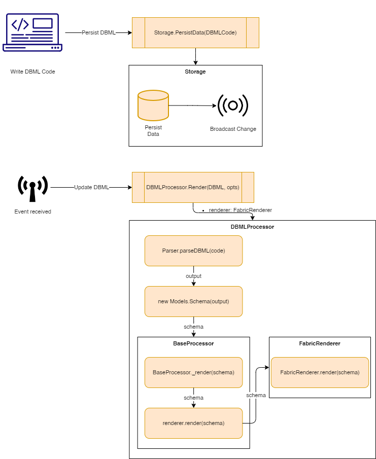

# Entity Relationshipt Diagrammer
Did you ever had the problem of using amazing tools like [Diagrams.Net](https://www.diagrams.net/) or [dbdiagram.io](https://dbdiagram.io/home) just to remember you would have to write the same design all over again in SQL Server Management Studio or MySQL Workbench?

The goal of this project is to solve this issue! We should be able to only design an ER Model once and let the tool generate our Data Definition Language (DDL) for us.

# Runtime workflow
The high level flow of the app is as follows.

# Main Libs:
- [FabricJS](http://fabricjs.com/)
- [DBML](https://www.dbml.org/js-module/)
